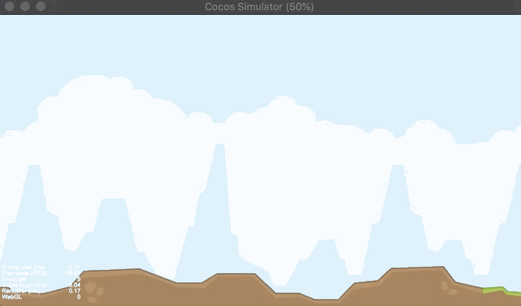

# CCSamples

[TOC]

介绍

CocosCreator功能demo

### ScrollMapDemo

说明：CC滚动地图组件

简书链接：https://www.jianshu.com/p/3030edc45147

### BumperCarDemo

参考文章：https://blog.csdn.net/kuokuo666/article/details/95728409

- [ ] 其他方式获取tile的坐标和尺寸
- [ ] TiledMap 对象层使用，地图动画，和CC交互
- [ ] 正交地图，正交（交错），六边形（交错）获取坐标和尺寸